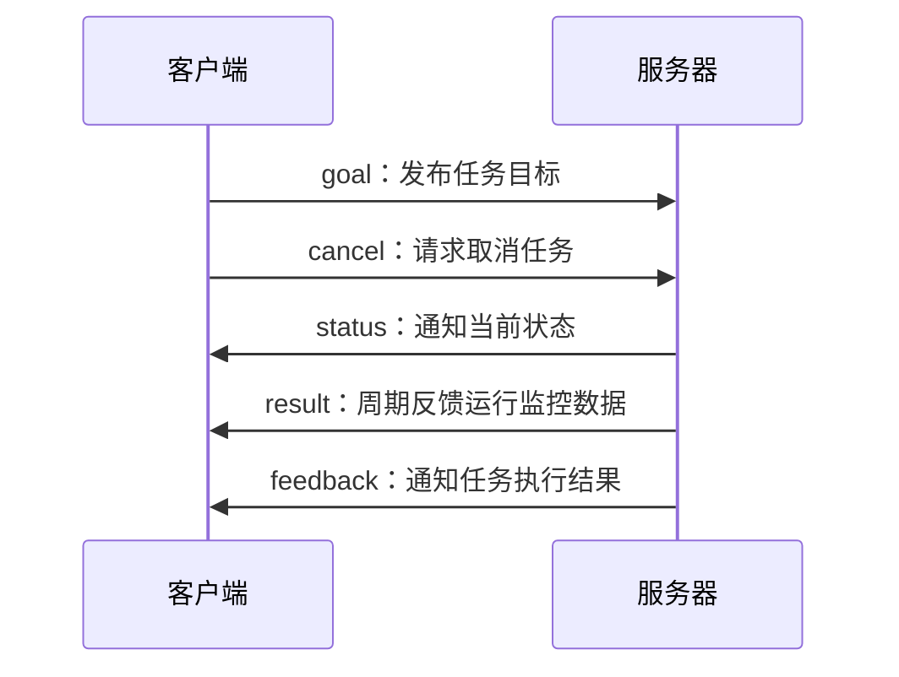

# action

action 提供了控制过程中的状态反馈，由 actionlib 功能包实现。



客户端和服务器在接收到上述五种通讯时会执行对应的回调函数。

# 动态参数

dynamic_reconfigure 功能包提供动态参数功能，允许在参数被修改后触发回调。

# SMACH 状态机

[文档](http://wiki.ros.org/cn/smach)

SMACH 是 python 实现的可扩展状态机库，使用功能包 executive_smach 与 ROS 集成。

启动调试接口后使用 [[图形界面工具#smach_viewer|smach_viewer]] 查看：

	sis = smach_ros.IntrospectionServer('server_name', sm, '/SM_ROOT')
	sis.start()
	# 进入状态机sm
	rospy.spin()
	sis.stop()

## 状态

创建一个状态需要从 State 基类继承，并实现 `State.execute(self,userdata)` 方法。

```python
class Foo(smach.State):
     def __init__(self):
        smach.State.__init__(self, outcomes=['outcome1', 'outcome2'],
	                        input_keys=['foo_input'],
	                        output_keys=['foo_output'])
     def execute(self, userdata):
        # Do something with userdata
        if userdata.foo_input == 1:
            return 'outcome1'
        else:
            userdata.foo_output = 3
            return 'outcome2'
```

-   **init**方法初始化状态类，并由其结果、输入键和输出键定义接口。 init 方法不能阻塞。
-   **execute**表明了进入状态后要做的事。可以在此方法中添加阻塞，返回代表退出当前状态。 
-   当一个状态完成后，它返回一个**outcome(结果)**。结果是一个用户定义的字符串，它描述了状态如何结束，一组可能的取值是\['succeeded', 'failed', 'awesome']。状态机根据结果确定要转移到的下一个状态。
- input_keys 表明这个状态的 `execute` 方法要从状态机的 `userdata` 中读取哪些键，读取未列出的键会抛出异常。
- output_keys 表明要写入哪些键，写入未列出的键会输出警告信息但不会中止程序。

![[sm_1.png|150]]

## 状态机

状态机实例具有成员 `userdata:smach.UserData`，可以保存各种数据类型且在状态间共享。

使用重新映射机制和 `userdata` 在状态之间、状态机和状态之间传递数据 ：`remapping` 确定了状态内 `userdata` 中键名到状态机 `userdata` 中键名的对应关系。也可以使用相同的键名而不使用 `remapping`。

```python
sm_top = smach.StateMachine(outcomes=['outcome4','outcome5'],
                          input_keys=['sm_input'],
                          output_keys=['sm_output'])
sm_top.userdate.key = val
with sm_top:
	smach.StateMachine.add('FOO', Foo(),
						transitions={'outcome1':'BAR',
									 'outcome2':'outcome4'},
						remapping={'foo_input':'sm_input',
								   'foo_output':'sm_data'})
	smach.StateMachine.add('BAR', Bar(),
						transitions={'outcome2':'FOO'},
						remapping={'bar_input':'sm_data',
								   'bar_output1':'sm_output'})
```

![[sm_2.png|400]]

![[sm_3.png|300]]

## 容器

### StateMachine

简单的状态机。

### Concurrence

SMACH 并发（Concurrence）的输出图指定了基于其子结果确定并发结果的策略。具体来说，map 是一个字典，其中键是并发的潜在结果，而值是将子标签映射到子结果的词典。一旦并发的所有状态都终止了，如果满足了这些子结果映射的一个，并发将返回其关联的结果。如果没有映射得到满足，则并发将返回其默认结果。

```python
cc = Concurrence(outcomes = ['outcome1', 'outcome2'],
                 default_outcome = 'outcome1',
                 input_keys = ['sm_input'],
                 output_keys = ['sm_output'],
                 outcome_map = {'succeeded':{'FOO':'succeeded',
                                             'BAR':'outcome2'},
                                'outcome3':{'FOO':'outcome2'}})
with cc:
    Concurrence.add('FOO', Foo())
    Concurrence.add('BAR', Bar())
```

上面的示例指定了以下策略: 

-   当 FOO 有结果 `succeeded`，BAR 有结果 `outcome2` 时，状态机将以结果 `succeeded` 退出。 
-   当 FOO 有结果 `outcome2`，状态机将以`outcome3`为结果退出, 独立于状态 BAR 的结果。

可以使用回调函数控制子状态退出时的行为：

```python
# 任何子状态退出时调用
def child_term_cb(outcome_map):
  if outcome_map['FOO'] == 'outcome3':
    return True # 退出所有子状态
  if outcome_map['BAR']:
    return True
  return False # 继续运行
# 所有子状态退出时调用
def out_cb(outcome_map):
   if outcome_map['FOO'] == 'succeeded':
      return 'outcome1'
   else:
      return 'outcome2'
sm = Concurrence(outcomes=['outcome1', 'outcome2'],
                 default_outcome='outcome1',
                 input_keys=['sm_input'],
                 output_keys=['sm_output'],
                 child_termination_cb = child_term_cb,
                 outcome_cb = out_cb)
                 
with sm:
   Concurrence.add('FOO', Foo(),
                   remapping={'foo_in':'input'})
   Concurrence.add('BAR', Bar(),
                   remapping={'bar_out':'bar_out'})
```

### Sequence

按顺序添加的状态如果以 `connector_outcome` 退出，则进入下一个状态。

```python
sq = Sequence(
        outcomes = ['succeeded','aborted','preempted'],
        connector_outcome = 'succeeded')
with sq:
    Sequence.add('MOVE_ARM_GRAB_PRE', MoveVerticalGripperPoseActionState())
    Sequence.add('MOVE_GRIPPER_OPEN', MoveGripperState(GRIPPER_MAX_WIDTH))
    Sequence.add('MOVE_ARM_GRAB',     MoveVerticalGripperPoseActionState())
    Sequence.add('MOVE_GRIPPER_CLOSE', MoveGripperState(grab_width))
    Sequence.add('MOVE_ARM_GRAB_POST', MoveVerticalGripperPoseActionState())
```

### Iterator

循环遍历一个状态或直到满足成功条件的状态为止。

## 状态

```python
from smach import State,CBState
from smach_ros import SimpleActionState,ServiceState
```

### 回调接口

`@smach.cb_interface(...)` 装饰器确定了回调函数的输入和输出数据，参数与 `State.__init__()` 相同。设定的键可以使用 ` userdata.key ` 访问。

### State

通用 SMACH 状态，继承它以创建新状态。

```python
def __init__(self, outcomes=[], input_keys=[], output_keys=[], io_keys=[]):
```

参数均为字符串数组，定义了状态的输入/输出数据和结果。

### CBState

这个状态在进入时执行回调。可以将附加的参数和关键字参数来初始化，当执行时这些 args 将被传递到回调函数中。

```python
@smach.cb_interface(input_keys=['q'],
                    output_keys=['xyz'],
                    outcomes=['foo'])
def my_cb(ud, x, y, z):
    ud.xyz = ud.q + x + y + z
    return 'foo'

cbs = CBState(my_cb,
              cb_args=[10],
              cb_kwargs={'z':2,'y':3})
```

### SimpleActionState

专用于调用 Action 的状态。

省略 `goal` 参数以创建空目标 Action 调用，传入请求实例以使用固定的目标。

假设 `userdata` 包含了相应的字段 `user_data_max` 和 `user_data_position`，将要设置的目标字段传入 `goal_slots` 并设置 `remapping`。

```python
sm = StateMachine(['succeeded','aborted','preempted'])
with sm:
    StateMachine.add('TRIGGER_GRIPPER',
                      SimpleActionState('action_server_namespace',
                                        GripperAction,
                                        goal_slots=['max_effort', 
                                                    'position']),
                      transitions={'succeeded':'APPROACH_PLUG'},
                      remapping={'max_effort':'user_data_max',
                                 'position':'user_data_position'})
```

或使用请求目标创建目标：

```python
sm = StateMachine(['succeeded','aborted','preempted'])
with sm:
    def gripper_goal_cb(userdata, goal):
       gripper_goal = GripperGoal()
       gripper_goal.position.x = 2.0
       gripper_goal.max_effort = userdata.gripper_input
       return gripper_goal
    StateMachine.add('TRIGGER_GRIPPER',
                      SimpleActionState('action_server_namespace',
                                        GripperAction,
                                        goal_cb=gripper_goal_cb,
                                        input_keys=['gripper_input'])
                      transitions={'succeeded':'APPROACH_PLUG'},
                      remapping={'gripper_input':'userdata_input'})
```

对于返回的结果，可以使用 `result_slots` 和 `remapping` 写入 `userdata`，也可以使用结果回调：

```python
sm = StateMachine(['succeeded','aborted','preempted'])
with sm:
    def gripper_result_cb(userdata, status, result):
       if status == GoalStatus.SUCCEEDED:
          userdata.gripper_output = result.num_iterations
          return 'my_outcome'
    StateMachine.add('TRIGGER_GRIPPER',
                      SimpleActionState('action_server_namespace',
                                        GripperAction,
                                        result_cb=gripper_result_cb,
                                        output_keys=['gripper_output'])
                      transitions={'succeeded':'APPROACH_PLUG'},
                      remapping={'gripper_output':'userdata_output'})
```

### ServiceState

专用于调用服务的状态。

省略 `request` 参数以创建空请求，传入请求实例以使用固定的请求，使用 `request_slots` 从用户数据获取或使用请求回调创建请求：

```python
@smach.cb_interface(input_keys=['gripper_input'])
def gripper_request_cb(userdata, request):
    gripper_request = GripperSrv().Request
    gripper_request.position.x = 2.0
    gripper_request.max_effort = userdata.gripper_input
    return gripper_request

ss = ServiceState('service_name',
			 GripperSrv,
			 request_cb = gripper_request_cb,
             input_keys = ['gripper_input'])
```

响应回调和 SimpleActionState 的结果回调类似，除了接收结果状态和结果数据之外，回调的第二个参数只是服务响应消息。